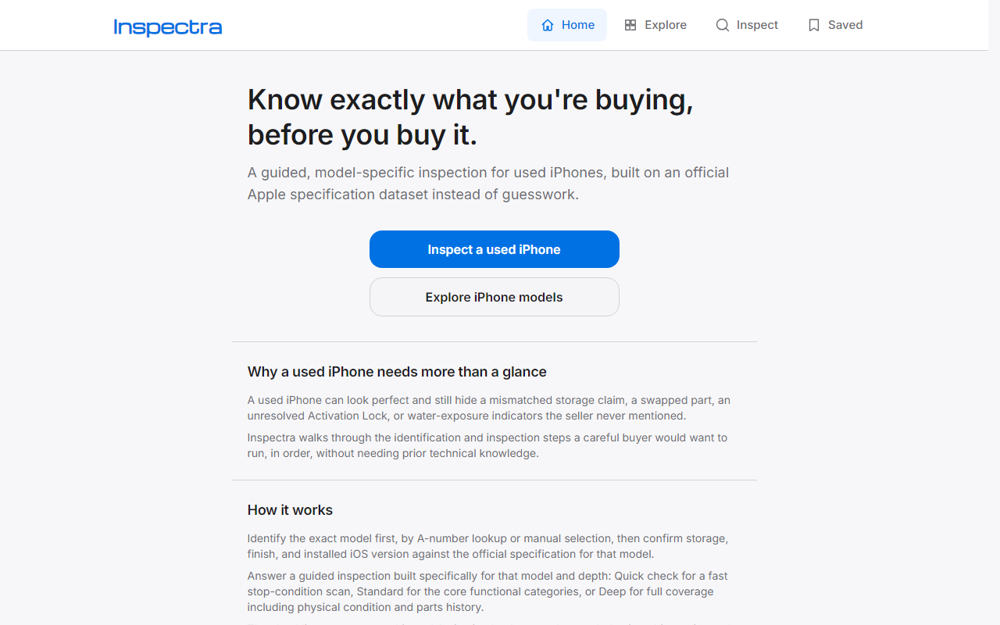
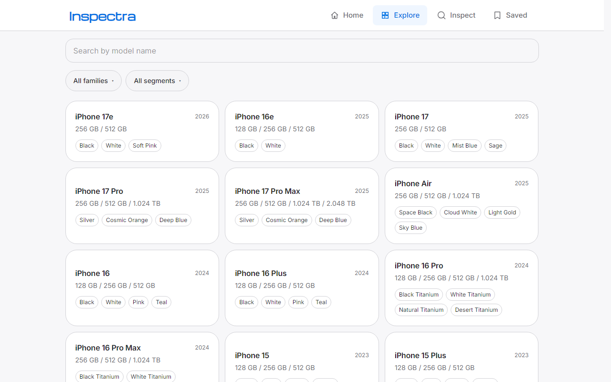
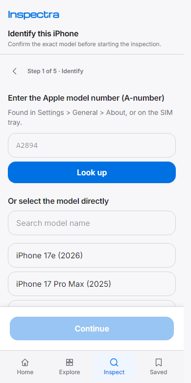

# Inspectra

**Know what you're buying.**

Inspectra is a mobile-first Progressive Web App that helps a buyer inspect a used iPhone while
meeting a seller. One phone runs Inspectra; the other is the phone being inspected. The app walks
through a guided, model-aware, regional-variant-aware, and iOS-aware workflow —
**Identify → Verify → Inspect → Analyze** — comparing what the buyer observes against the official
specifications in a supplied dataset, running browser-assisted diagnostics where the platform
allows it, and producing a transparent analytical report. It never guarantees a phone is genuine,
never guarantees future performance, and never tells the user to buy.

Everything Inspectra shows is sourced from the supplied dataset or from what the buyer directly
observes during the inspection. It does not invent specifications, does not silently fall back to
mock data, and does not browse the web at runtime to fill in the gaps.

## What this is

A used iPhone can look perfect in person and still hide a mismatched storage claim, a swapped
part, an unresolved Activation Lock, or liquid-exposure indicators the seller never mentioned.
Inspectra turns that judgment call into a structured, repeatable checklist that's specific to the
exact model in front of you — not a generic "things to check on any phone" list.

<p align="center">
  
</p>

## How it works

1. **Identify** — enter the Apple model number (A-number) from Settings/SIM tray for an exact
   match, or search and select the model directly. Confirm storage, finish, and installed iOS
   version against the official specification for that model.
2. **Verify** — Inspectra flags inconsistencies as they're found: a selected model that doesn't
   match the entered A-number, an observed storage/finish that doesn't match the official spec,
   and so on — as findings, not silent overrides.
3. **Inspect** — answer a guided checklist built specifically for that model, at the depth you
   choose:
   - **Quick** — a fast scan for an official stop condition or a hidden liquid-exposure indicator.
   - **Standard** — the core functional categories: identity/configuration, ownership & activation,
     parts & repair history, battery, display & touch, cameras, biometrics & sensors, controls &
     haptics, charging & ports, cellular/Wi-Fi/Bluetooth, liquid exposure, and software health.
   - **Deep** — every applicable check the dataset supports, including physical condition, exact
     spec matching, and a guided (manual, user-performed) Apple coverage check.

   The checklist is delivered one question at a time on mobile — not a giant list dumped on
   screen at once — with browser-assisted diagnostics run automatically where the platform allows
   it (e.g. camera/mic permission checks), each declared as **supported**, **unsupported**, or
   **inconclusive**, never guessed.

4. **Analyze** — get a report that separates confirmed dataset facts, your own observations, and
   flagged inconsistencies, so it's clear what was actually checked and what still depends on
   trusting the seller.

<p align="center">
  
  &nbsp;
  
</p>

Every inspection is saved locally (IndexedDB) on the device running Inspectra, can be interrupted
and resumed, and is never uploaded anywhere — there's no account and no server.

## Tech stack

- HTML5, Tailwind CSS, modular vanilla JavaScript (ES modules) — no framework.
- [Vite](https://vite.dev/) for local development and production bundling.
- IndexedDB for inspection state and local evidence.
- A hand-written Service Worker + Cache Storage for offline/PWA support.
- [Vitest](https://vitest.dev/) + jsdom for unit/integration tests, [Playwright](https://playwright.dev/) for end-to-end tests.
- ESLint + Prettier for code quality.

## Getting started

```bash
npm install
```

Before running the app, populate the dataset:

```text
data/iphone/
```

**This step is mandatory.** Inspectra ships without any iPhone data — the project owner supplies a
validated dataset (device catalog, variants, capabilities, iOS releases, inspection rules,
localization, etc.) and it must be placed inside `data/iphone/` (either directly, e.g.
`data/iphone/manifest.json`, or inside a version-namespaced subfolder, e.g.
`data/iphone/v1.0.0/manifest.json`) before `npm run dev` or `npm run build` will work. Inspectra
**never creates, edits, normalizes, or repairs anything inside `data/iphone/`** — if the folder is
missing or the dataset fails validation, the app shows a blocking error screen instead of falling
back to mock data.

Once the dataset is in place:

```bash
npm run dev
```

## Available scripts

| Script                  | Description                                                                              |
| ----------------------- | ---------------------------------------------------------------------------------------- |
| `npm run dev`           | Resolves the dataset version, then starts the Vite dev server.                           |
| `npm run build`         | Validates the dataset, builds for production, then copies it into `dist/`.               |
| `npm run preview`       | Serves the production build locally.                                                     |
| `npm run test`          | Runs the unit/integration test suite (Vitest) once.                                      |
| `npm run test:watch`    | Runs the test suite in watch mode.                                                       |
| `npm run test:e2e`      | Runs end-to-end tests (Playwright).                                                      |
| `npm run lint`          | Lints the codebase with ESLint.                                                          |
| `npm run format`        | Formats the codebase with Prettier.                                                      |
| `npm run validate:data` | Resolves the dataset version and validates `data/iphone/` against schema/checksum rules. |

## Notes

- The app deploys as a static Vite build to Vercel from the domain root (`base: "/"` in
  `vite.config.js`) — see `vercel.json`.
- Inspections autosave locally (IndexedDB) and can be interrupted and resumed.
- The Service Worker caches the app shell and dataset for offline use. Its cache name is derived
  from both the app version and the dataset manifest version, so an app release or a dataset
  update each get a fresh cache namespace instead of silently serving stale data.

## Disclaimer

> This tool provides informational and analytical assistance only. Results depend on the
> information entered, the tests completed, manufacturer specifications, and available technical
> data. It cannot guarantee authenticity, ownership, remaining lifespan, repair history, liquid
> exposure, water resistance, future performance, market value, or suitability for purchase.

This assessment is informational only and is not a guarantee, professional device inspection,
ownership verification, valuation, warranty, or purchase recommendation. The user remains
responsible for the transaction and purchasing decision.

- No automated IMEI blacklist, financing, or lost/stolen lookup is included.
- No visual or software check can prove that a device has never been repaired or exposed to
  liquid.
- No completed checklist can guarantee future performance.
- Third-party carrier, account, network, and marketplace conditions can affect observations.
- Apple specifications and settings paths can change and require periodic reverification.
